# Claude Fable 5.1 Theme Workflow

An agent skill that distills the **publicly visible colour states** of Anthropic's Claude Fable 5.1 page — **Noon** (blue), **Night** (deep blue-black), and **Morning** (warm paper / gray-violet) — into a reusable design system for archive-style editorial pages, research reports, fixed-stage decks, data stories, and social/print cards.

> **Style study — not official, not affiliated with Anthropic.** This repository ships no Anthropic fonts, logos, illustrations, 3D assets, or page source code. It is an independent, implementation-neutral extraction of colour, hierarchy, spacing, and interaction patterns observed on a public page (see [`references/source-audit.md`](references/source-audit.md)).

## Screenshots

**Theme lab** — [`examples/theme-lab.html`](examples/theme-lab.html), one fictional article rendered in all three modes. The hero is a full-bleed mode artwork under a colour-field wash; the overlaid grid (date / title / standfirst / index) never moves when modes switch.

| Noon | Night | Morning |
|---|---|---|
| 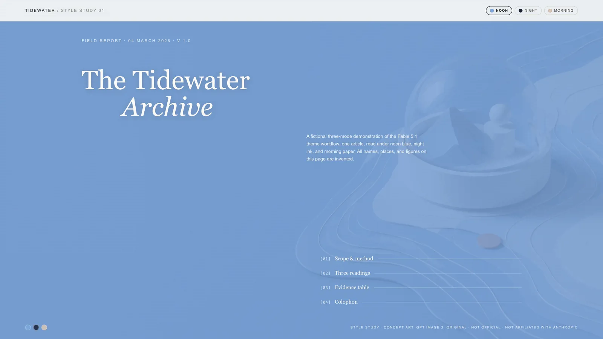 | 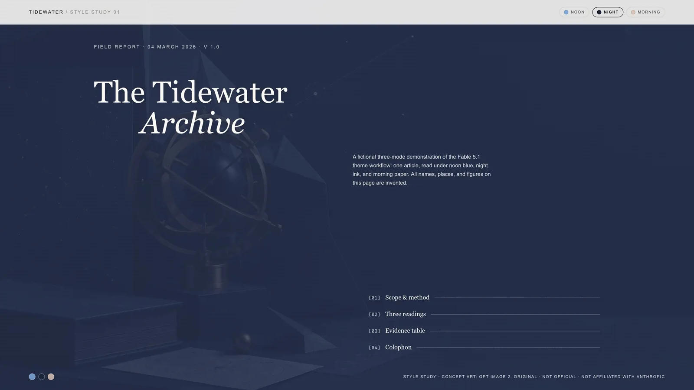 | 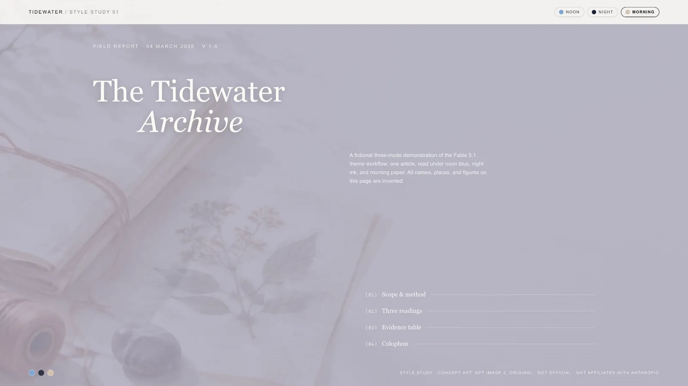 |

| Evidence section | Mobile |
|---|---|
| 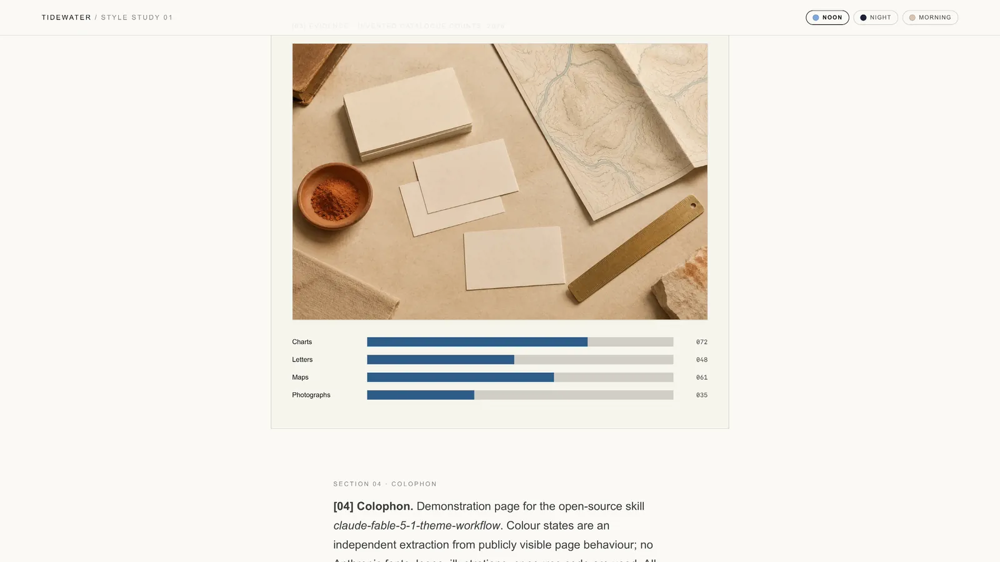 | 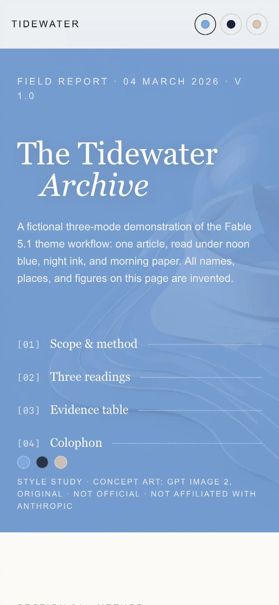 |

**Archive deck** — [`examples/theme-deck.html`](examples/theme-deck.html), a six-slide single-file HTML deck with horizontal paging (keyboard / wheel / touch / pager dots / index jumps). Mode switching swaps the full-bleed artwork, the colour field, and the accents live.

| Cover · Noon | Modes · Night | Evidence · paper page |
|---|---|---|
| 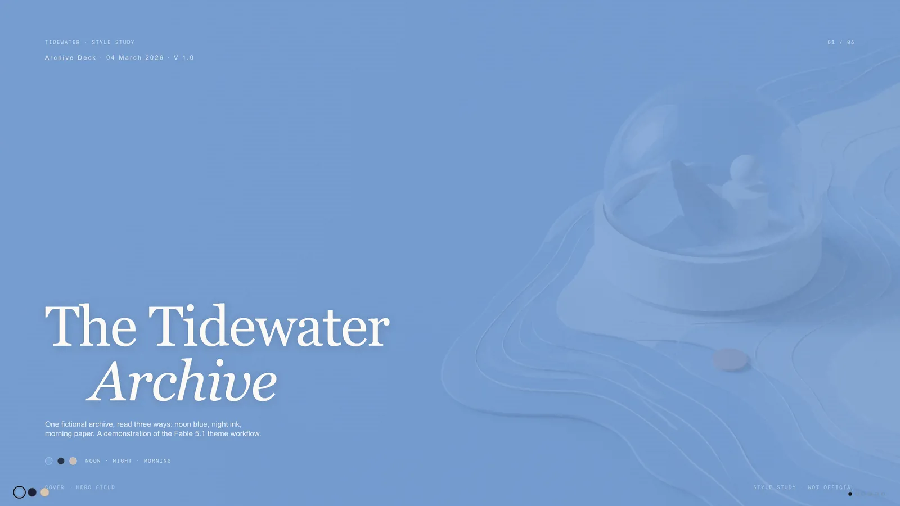 | 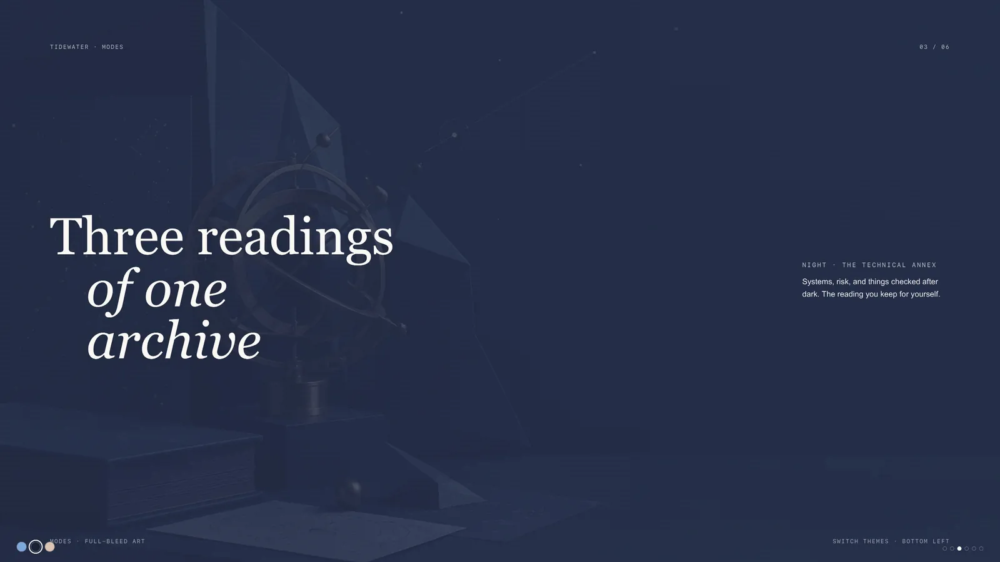 |  |

**Real-content case** — [`examples/case-deepseek-v41/`](examples/case-deepseek-v41/), a ten-slide Chinese deck about the DeepSeek V4.1 Flash two-day beta (Sep 8–10, 2026), built with the same deck route in night mode. Facts cross-checked across multiple same-day reports; community speed benchmarks labelled as informal.

| Cover | Event | Speed evidence |
|---|---|---|
| 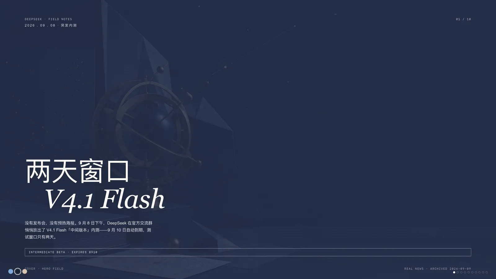 | 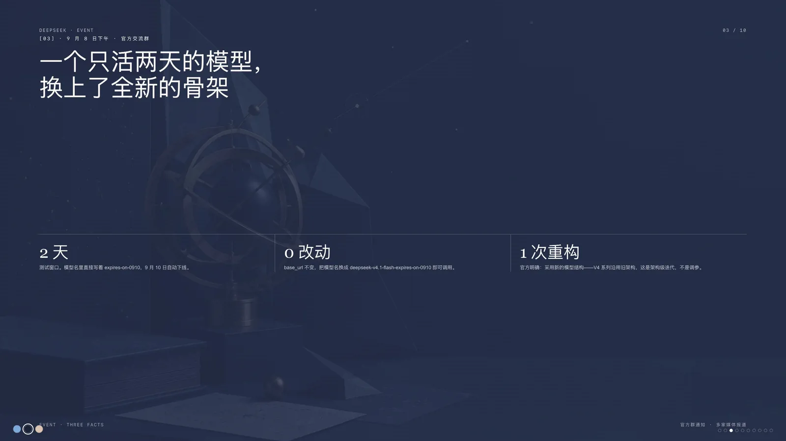 | 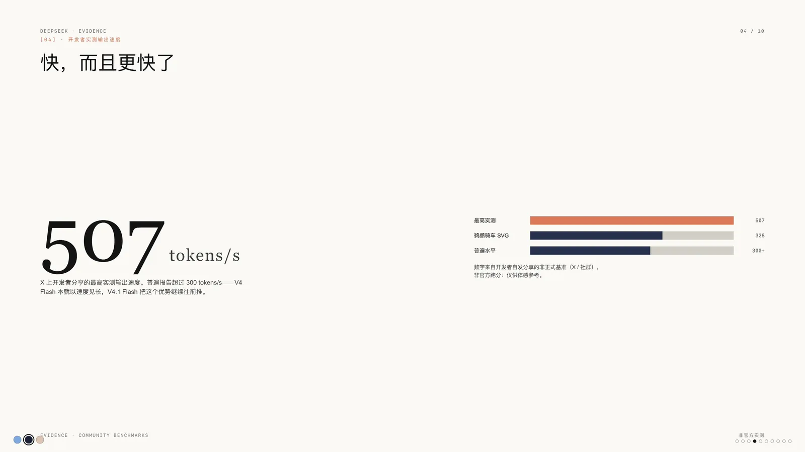 |

| Timeline | The question |
|---|---|
| 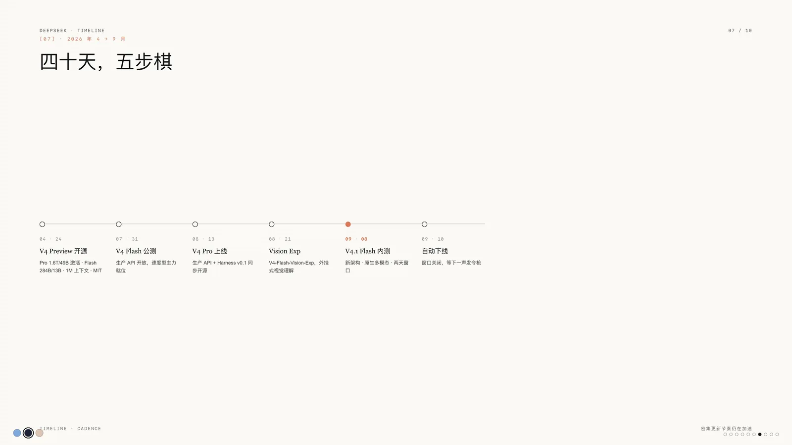 | 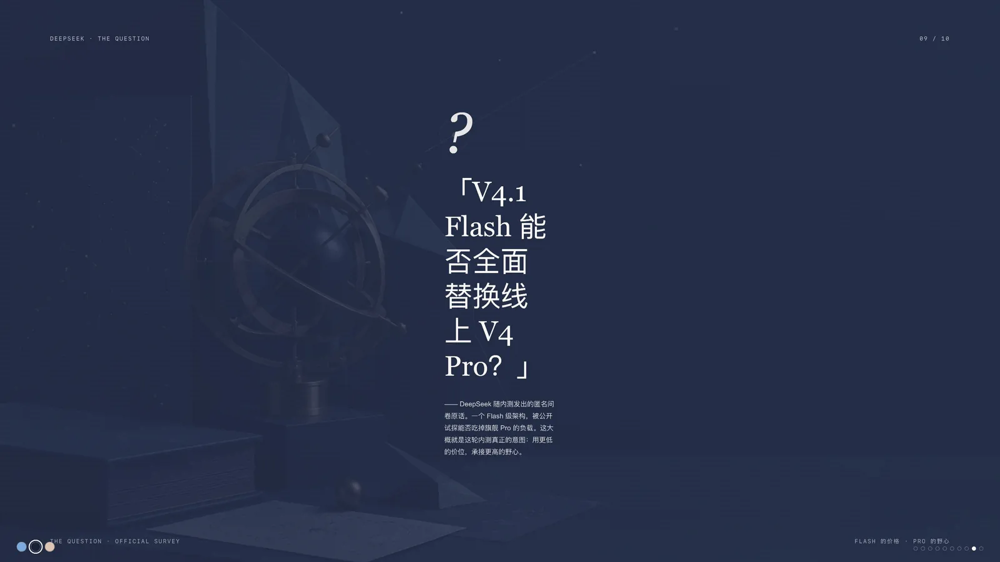 |

## Contents

```
SKILL.md                          The skill (agent-instruction format)
references/
  source-audit.md                 What was observed on the public page, and the reproduction boundary
  theme-tokens.json               Colour / spacing / layout / typography tokens
  theme-recipes.md                Layout skeleton, CSS state contract, component recipes, responsive rules
  output-matrix.md                Which mode fits which output; recommended recipes
  image-prompts.md                GPT Image 2 prompt recipes + quality gate for mode artwork
  layered-ambient-glass.md        Optional route: neutral paper + transparent ambient plates + local glass
  deck-html.md                    Single-file HTML deck route: paging contract, pitfalls, acceptance
examples/
  theme-lab.html                  Self-contained three-mode editorial page (fictional content)
  theme-deck.html                 Six-slide horizontal-paging deck, theme-switchable (fictional content)
  case-deepseek-v41/              Real-content case: ten-slide deck on the DeepSeek V4.1 Flash beta
  assets/*.webp                   Original GPT Image 2 concept art + one editorial illustration
docs/screenshots/                 Verification screenshots of both demos
```

## Usage

Copy the skill folder into any agent-skill-compatible loader (e.g. Claude Code `~/.claude/skills/`, Cursor, or Minis), then ask for things like:

- “用 Noon/Night/Morning 三个主题做一份档案式 HTML 专题页”
- “Make an archive-style deck in the Fable 5.1 night style”
- “把这页官网风格迁移成 morning 编辑长文”

Open `examples/theme-lab.html` or `examples/theme-deck.html` directly in a browser to try the demos; the theme switcher swaps the mode tokens and the mode artwork without changing the DOM structure.

## What the skill enforces

- **Three named states, used one at a time** — never blended into a gradient poster.
- **Archive grammar**: date/version line, numbered index with dot leaders, asymmetric serif titles, solid colour fields, a 640px reading column, and a visible source/credit line. At least four of these on every output.
- **Output routing**: editorial web, fixed-stage 16:9 archive deck, research/data story, social/print card — each with its own composition rules.
- **Generated-image workflow** (opt-in): one independent, text-free mode artwork per state with composition bias (Noon subject-right, Night subject-left, Morning lower-left), real `alt` text, and an explicit “unofficial asset, not evidence” boundary. Prompt recipes included.
- **Layered ambient glass route** for image-led pages: stable neutral paper + true-alpha ambient plates + restrained local glass instead of recolouring the whole document.
- **Anti-slop gates**: no purple-blue gradients, no glassmorphism walls, no “centered hero + three cards + CTA” SaaS template, no emoji icons, no fake data presented as real.
- **Accessibility & states**: visible focus, keyboard-navigable index, `prefers-reduced-motion`, mobile breakpoint, no external font/network dependency required to stay readable.

## Fonts

The public page loads proprietary typefaces (Anthropic Sans/Serif/Mono, Copernicus, Styrene, Tiempos, JetBrains Mono). They are **not** distributed here. Use licensed copies if you have them; otherwise the skill maps to system fallbacks: Georgia/Times for display, Arial/Helvetica/Aptos for UI, ui-monospace/Menlo for data.

## Generated assets

`examples/assets/*.webp` are original images generated with GPT Image 2 from the prompt recipes in `references/image-prompts.md`. They contain no text, logos, people, or brand marks, are not official Anthropic material, and are not evidence of anything. Regenerate your own with the same recipes if you prefer.

## 中文介绍

这是一个把 Anthropic Claude Fable 5.1 官网**公开可见的三种色彩状态**——Noon（正午蓝）、Night（深蓝黑）、Morning（暖白 / 灰紫）——提炼成可复用设计系统的 Agent Skill，适用于档案式编辑页面、研究报告、数据叙事、时间线，以及**单文件 HTML 翻页演讲稿（deck）**和社交 / 打印卡片。

**仓库里有什么**

- `SKILL.md`：完整工作流——三状态色彩 tokens、档案语法（日期行 / 编号目录 / 点状 leader / 非对称标题 / 单色场）、输出路由（编辑页 / 固定舞台 deck / 单文件 HTML 翻页 deck / 数据叙事 / 卡片）、生图工作流、分层氛围玻璃路由、Anti-slop 门禁与验收清单。
- `references/`：来源审计、tokens JSON、组件配方、输出矩阵、GPT Image 2 提示词配方、分层玻璃材质规范，以及 `deck-html.md` 单文件翻页 deck 的机制契约与踩坑清单。
- `examples/`：三个演示——`theme-lab.html`（三主题编辑长页，全幅 hero 图 + 色场罩）、`theme-deck.html`（六页横向翻页 deck，键盘 / 滚轮 / 触屏 / 圆点翻页，主题实时切换）、`case-deepseek-v41/`（真实内容案例：DeepSeek V4.1 Flash 两天内测十页中文 deck，night 模式，事实经多源核实）。虚构演示内容全部标注；配图均为 GPT Image 2 原创概念图（非官方资产、不作为证据）。
- `docs/screenshots/`：桌面 1920×1080 与移动端 390×844 的真实验收截图。

**设计要点**：一份内容三种读法，切换只换 tokens 与氛围图，信息架构永不动；大面积单色场 + 640px 阅读列 + 880px 证据区；深色页是深蓝黑而非纯黑，纸面页是暖白而非空白模板；禁止紫蓝渐变、玻璃卡片墙和「居中大标题 + 三卡片 + CTA」模板。

**边界声明**：本仓库不含任何 Anthropic 字体、Logo、插画或页面源码，为独立的风格研究（style study），与 Anthropic 无隶属或背书关系。字体默认回退到 Georgia / Arial / ui-monospace 系统栈。MIT 协议。

## License

MIT — see [LICENSE](LICENSE). “Claude”, “Fable” and related marks belong to Anthropic; this project is an unofficial style study with no affiliation or endorsement.
